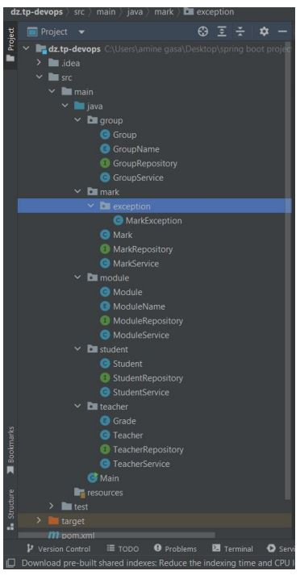
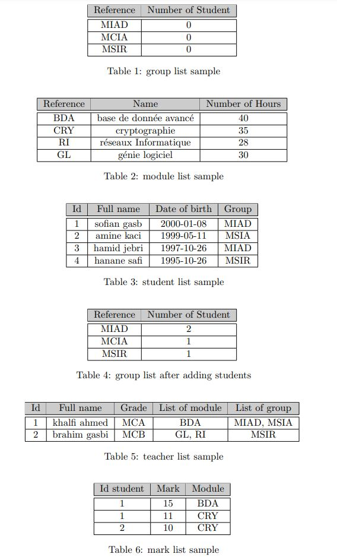

# student Marks Management Project

## the objectives project
- to enhance your knowledge in Object Oriented Programming
- best practices to make a flexible and maintainable code
  ## description problem
we try to manage the student marks given by different teachers in a specific module. 

each **student** is characterized by :
- id (auto increment)
- full Name student
- date of birth
- group(MSIR ,MIAD,. . . )

each **teacher** is characterized by :
- id (auto increment)
- full name teacher
- grade (,MCA,MCB..)
- list modules that he/she teaches
- list of the attached group which he/she teaches

each **group** is characterized by :
- reference group
- number of students

each **module** is characterized by :
- reference
- name
- number of hours

each **mark** is characterized by :
- an integer value between (5-20) which is given by a teacher to a student in a specific module

  ### in addition
1. each **teacher** can teach one or more **groups**.
2. May **the teacher** teach more than one **module**.
3. each **student** is attached to a single **group**.
4. each **mark** is related to a single **student** in a specific **module**.
5. don’t forget to update the total number of students in the group class when you add or delete a student.

##  How i can organize my project? 
from the above description we create five packages, each one has  classes that do specific tasks
- package 1 module
- package 2 group
- package 3 student
- package 4 teacher
- package 5 mark

## testing samples

